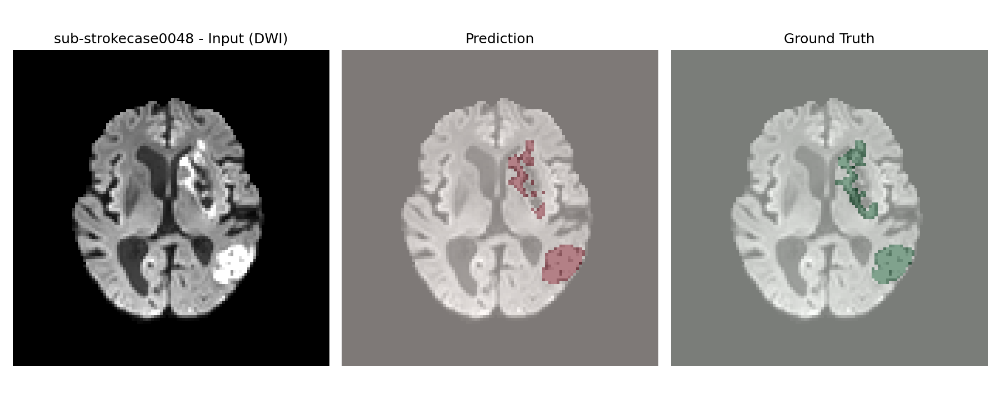

<h1 align="center">CLIP-Driven Universal Model for Stroke Lesion Segmentation</h1>

<!-- <div align="center">


[](https://github.com/ljwztc/CLIP-Driven-Universal-Model/stargazers)
<a href="https://twitter.com/bodymaps317">
        
</a><br/>
**Subscribe us: https://groups.google.com/u/2/g/bodymaps**  

</div> -->

<p align="center"></p>

---

## About This Fork

This repository adapts the original [CLIP-Driven Universal Model](https://github.com/ljwztc/CLIP-Driven-Universal-Model) for **stroke lesion segmentation** using the [ISLES dataset](https://www.isles-challenge.org/).  
We leverage the CLIP-based multi-modal approach to segment stroke lesions in brain MRI scans, generating text prompts from ISLES metadata (e.g., hemisphere, lesion volume) and combining CLIP text embeddings with a 3D vision encoder for improved segmentation performance.

- **Original model:** Designed for universal organ segmentation and tumor detection from CT.
- **This adaptation:** Focused on stroke lesion segmentation from MRI, using ISLES data and stroke-specific text prompts.

All original model features, training, and evaluation scripts are retained, with modifications for MRI data and stroke lesion tasks.

---

<!-- ## News
 - 🔥 The pseudo-label with manual refinement could be found in [AbdonmenAtlas 1.0](https://github.com/MrGiovanni/AbdomenAtlas)
 - 🔥 We collect recent medical universal models in [AWESOME MEDICAL UNIVERSAL MODEL](documents/awesome.md) [](https://awesome.re).
 - 😎 We have document for [common questions for code](documents/common_code_questions.md) and [common questions for paper](documents/common_paper_questions.md). -->

## Paper
This repository references the official implementation of Universal Model.

<b>Universal and Extensible Language-Vision Models for Organ Segmentation and Tumor Detection from Abdominal Computed Tomography</b> <br/>
[Jie Liu](https://ljwztc.github.io)<sup>1</sup>, [Yixiao Zhang](https://scholar.google.com/citations?hl=en&user=lU3wroMAAAAJ)<sup>2</sup>, [Jie-Neng Chen](https://scholar.google.com/citations?hl=en&user=yLYj88sAAAAJ)<sup>2</sup>,  [Junfei Xiao](https://lambert-x.github.io)<sup>2</sup>, [Yongyi Lu](https://scholar.google.com/citations?hl=en&user=rIJ99V4AAAAJ)<sup>2</sup>, <br/>
[Yixuan Yuan](https://scholar.google.com.au/citations?user=Aho5Jv8AAAAJ&hl=en)<sup>1</sup>, [Alan Yuille](https://scholar.google.com/citations?user=FJ-huxgAAAAJ&hl=en)<sup>2</sup>, [Yucheng Tang](https://tangy5.github.io)<sup>3</sup>, [Zongwei Zhou](https://www.zongweiz.com)<sup>2</sup> <br/>
<sup>1 </sup>City University of Hong Kong,   <sup>2 </sup>Johns Hopkins University,   <sup>3 </sup>NVIDIA <br/>
Medical Image Analysis, 2024 <br/>
[paper](https://www.cs.jhu.edu/~alanlab/Pubs24/liu2024universal.pdf) | [code](https://github.com/ljwztc/CLIP-Driven-Universal-Model)

<b>CLIP-Driven Universal Model for Organ Segmentation and Tumor Detection</b> <br/>
${\color{red} {\textbf{Rank First in Medical Segmentation Decathlon (MSD) Competition}}}$ (see [leaderboard](https://decathlon-10.grand-challenge.org/evaluation/challenge/leaderboard/)) <br/>
[Jie Liu](https://ljwztc.github.io)<sup>1</sup>, [Yixiao Zhang](https://scholar.google.com/citations?hl=en&user=lU3wroMAAAAJ)<sup>2</sup>, [Jie-Neng Chen](https://scholar.google.com/citations?hl=en&user=yLYj88sAAAAJ)<sup>2</sup>,  [Junfei Xiao](https://lambert-x.github.io)<sup>2</sup>, [Yongyi Lu](https://scholar.google.com/citations?hl=en&user=rIJ99V4AAAAJ)<sup>2</sup>, <br/>
[Yixuan Yuan](https://scholar.google.com.au/citations?user=Aho5Jv8AAAAJ&hl=en)<sup>1</sup>, [Alan Yuille](https://scholar.google.com/citations?user=FJ-huxgAAAAJ&hl=en)<sup>2</sup>, [Yucheng Tang](https://tangy5.github.io)<sup>3</sup>, [Zongwei Zhou](https://www.zongweiz.com)<sup>2</sup> <br/>
<sup>1 </sup>City University of Hong Kong,   <sup>2 </sup>Johns Hopkins University,   <sup>3 </sup>NVIDIA <br/>
ICCV, 2023 <br/>
[paper](https://arxiv.org/pdf/2301.00785.pdf) | [code](https://github.com/ljwztc/CLIP-Driven-Universal-Model) | [slides](https://github.com/ljwztc/CLIP-Driven-Universal-Model/blob/main/documents/slides.pdf) | [poster](https://github.com/ljwztc/CLIP-Driven-Universal-Model/blob/main/documents/poster.pdf) | [talk](https://www.youtube.com/watch?v=bJpI9tCTsuA) | blog

<b>Large Language-Image Model for Multi-Organ Segmentation and Cancer Detection from Computed Tomography</b> <br/>
[Jie Liu](https://ljwztc.github.io)<sup>1</sup>, [Yixiao Zhang](https://scholar.google.com/citations?hl=en&user=lU3wroMAAAAJ)<sup>2</sup>, [Jie-Neng Chen](https://scholar.google.com/citations?hl=en&user=yLYj88sAAAAJ)<sup>2</sup>,  [Junfei Xiao](https://lambert-x.github.io)<sup>2</sup>, [Yongyi Lu](https://scholar.google.com/citations?hl=en&user=rIJ99V4AAAAJ)<sup>2</sup>, <br/>
[Yixuan Yuan](https://scholar.google.com.au/citations?user=Aho5Jv8AAAAJ&hl=en)<sup>1</sup>, [Alan Yuille](https://scholar.google.com/citations?user=FJ-huxgAAAAJ&hl=en)<sup>2</sup>, [Yucheng Tang](https://tangy5.github.io)<sup>3</sup>, [Zongwei Zhou](https://www.zongweiz.com)<sup>2</sup> <br/>
<sup>1 </sup>City University of Hong Kong,   <sup>2 </sup>Johns Hopkins University,   <sup>3 </sup>NVIDIA <br/>
RSNA, 2023 <br/>
[abstract](https://github.com/ljwztc/CLIP-Driven-Universal-Model/blob/main/documents/rnsa_abstract.pdf) | [code](https://github.com/ljwztc/CLIP-Driven-Universal-Model) | slides

---

## Model

| Architecture | Param | Download |
|  ----  | ----  |  ----  |
| U-Net  | 19.08M | [link](https://huggingface.co/ljwztc/CLIP-Driven-Universal-Model/resolve/main/clip_driven_universal_unet.pth?download=true) |
| Swin UNETR | 62.19M | [link](https://huggingface.co/ljwztc/CLIP-Driven-Universal-Model/resolve/main/clip_driven_universal_swin_unetr.pth?download=true) |

---

## Dataset

- This fork uses the [ISLES dataset](https://www.isles-challenge.org/) for stroke lesion segmentation in brain MRI.
- Text prompts are generated from ISLES metadata (e.g., hemisphere, lesion volume) and encoded using CLIP.
- The model combines these text embeddings with a 3D vision encoder for multi-modal segmentation.

---

## Usage

1. **Prepare ISLES data:**  
   Download and arrange the ISLES dataset as required.

2. **Generate text prompts and CLIP embeddings:**  
   Use the provided scripts to generate text prompts from ISLES metadata and encode them with CLIP.

3. **Train the model:**  
   Use the training scripts as in the original repository, with configuration adapted for MRI and stroke lesion segmentation.

4. **Evaluate and visualize results:**  
   Use the provided evaluation and visualization scripts to assess segmentation performance.

---

## Original Instructions

The following instructions are from the original repository and remain applicable for general usage, training, and evaluation.  
(See below for details on environment setup, dataset preprocessing, training, validation, and evaluation.)

---

## Citation

If you find this repository or the original model useful, please consider citing the following paper:
```
@inproceedings{liu2023clip,
  title={Clip-driven universal model for organ segmentation and tumor detection},
  author={Liu, Jie and Zhang, Yixiao and Chen, Jie-Neng and Xiao, Junfei and Lu, Yongyi and A Landman, Bennett and Yuan, Yixuan and Yuille, Alan and Tang, Yucheng and Zhou, Zongwei},
  booktitle={Proceedings of the IEEE/CVF International Conference on Computer Vision},
  pages={21152--21164},
  year={2023}
}
```
